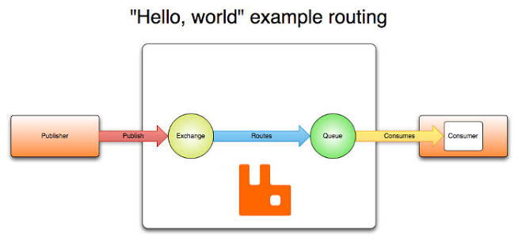
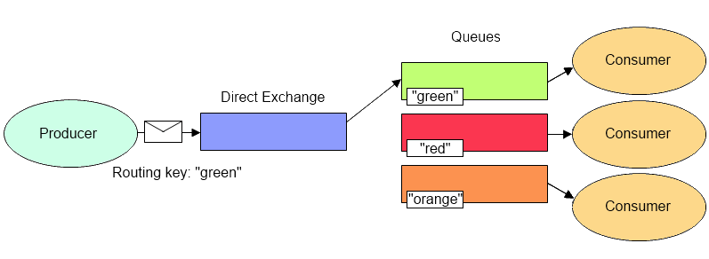
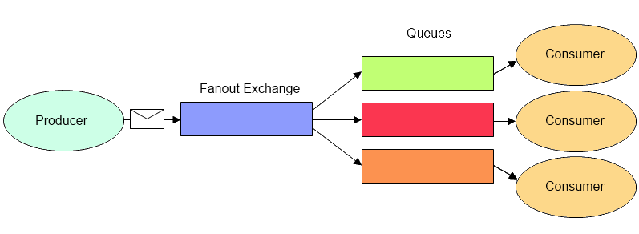
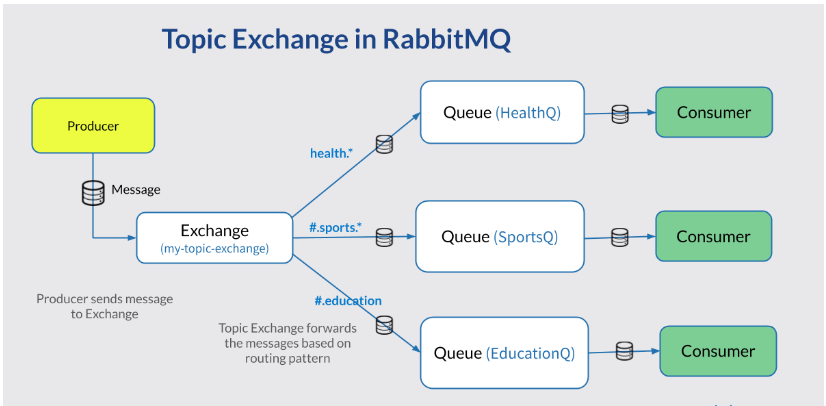

# rabbitMQ

### Utilizando RabbitMQ em uma arquitetura de microsserviços com Spring Boot

### O que é RabbitMQ?

Antes de começarmos, é importante entender o que é o RabbitMQ.

O RabbitMQ é um **broker de mensagens**, assim como o Apache Kafka. Sua principal função é permitir a comunicação assíncrona entre aplicações por meio do envio e recebimento de mensagens.

De forma simplificada, podemos imaginar o RabbitMQ como um intermediário responsável por receber mensagens de um serviço e entregá-las para outro. Isso reduz o acoplamento entre as aplicações e aumenta a escalabilidade da arquitetura.

### Cenário da aplicação

Em nossa aplicação, temos dois microsserviços:

* **user-service**: responsável pelo cadastro de usuários.
* **email-service**: responsável pelo envio de e-mails.

Quando um usuário é cadastrado, o **user-service** produz uma mensagem contendo os dados necessários e a envia para o RabbitMQ.

O RabbitMQ recebe essa mensagem e a disponibiliza em uma fila. Em seguida, o **email-service** consome a mensagem da fila e envia um e-mail de boas-vindas para o usuário cadastrado.

Dessa forma, o cadastro do usuário não depende diretamente do envio do e-mail, tornando o sistema mais desacoplado e resiliente.

### Configurando o RabbitMQ

Para utilizar o RabbitMQ, precisamos criar uma instância e obter as informações de conexão.

Neste exemplo, utilizaremos o CloudAMQP, um serviço que fornece instâncias gerenciadas do RabbitMQ.

Acesse o site do CloudAMQP e crie uma instância gratuita. Após a criação, você terá acesso às informações de conexão, como host, usuário, senha e virtual host, que serão utilizadas na configuração da aplicação.



<figure><figcaption></figcaption></figure>

<figure><figcaption></figcaption></figure>

```java
rabbitmq:
  host: chameleon.lmq.cloudamqp.com
  username: qknjvqyn
  password: GJ3aHWASwX1FreWIkxuYJBjUsJmuSzo4
  virtual-host: qknjvqyn
```

agora que temos o rabbit configurado, podemos partir para a implementação na aplicação, mas antes precisamos explicar alguns conceitos.

### Consumer

O **Consumer** é o componente responsável por consumir as mensagens enviadas para uma fila.

Quando trabalhamos com mensageria, dois conceitos são fundamentais: **filas** e **mensagens**. Os produtores enviam mensagens para as filas, e os consumidores ficam responsáveis por processá-las.

Vamos utilizar o seguinte cenário como exemplo:

Nossa aplicação possui um serviço de usuários responsável por realizar o cadastro de novos usuários. Quando um usuário é cadastrado, contendo informações como nome, e-mail e senha, queremos enviar automaticamente um e-mail de boas-vindas.

Nesse caso, o **user-service** será responsável por produzir a mensagem informando que um novo usuário foi cadastrado. Já o **email-service** será responsável por consumir essa mensagem e realizar o envio do e-mail.

Portanto, o **Consumer** será o serviço de e-mail, pois é ele quem receberá e processará a mensagem enviada para a fila.

#### Implementação

Após configurar a conexão com o RabbitMQ, precisamos criar uma classe de configuração responsável por registrar os componentes que serão utilizados pela aplicação.

Nesta configuração, iremos:

* Definir o nome da fila que será utilizada para o envio das mensagens.
* Criar a fila no RabbitMQ durante a inicialização da aplicação.
* Configurar um conversor de mensagens para transformar objetos Java em JSON e vice-versa.

```java
@Configuration
public class RabbitMq {

    private static final String queueName = "email-queue";

    @Bean
    public Queue queue() {
        return new Queue(queueName, true);
    }

    @Bean
    public JacksonJsonMessageConverter messageConverter(){
        JsonMapper jsonMapper = new JsonMapper();
        return new JacksonJsonMessageConverter(jsonMapper);
    }
}
```

Neste exemplo, a constante `queueName` define o nome da fila que será criada no RabbitMQ.

O método `queue()` registra uma fila chamada `email-queue`. O parâmetro `true` indica que a fila é **durável**, ou seja, ela continuará existindo mesmo após a reinicialização do broker.

Já o método `messageConverter()` configura um `JacksonJsonMessageConverter`, responsável por converter automaticamente objetos Java para JSON no momento do envio da mensagem e converter o JSON recebido de volta para um objeto Java durante o consumo da fila.

Essa configuração simplifica a comunicação entre os microsserviços, pois não é necessário realizar manualmente a serialização e desserialização dos objetos trafegados pelo RabbitMQ.

Com o RabbitMQ configurado, podemos implementar a classe responsável pelo **Consumer**.

Nesta implementação, iremos:

* Definir um método responsável por consumir as mensagens recebidas.
* Utilizar a anotação `@RabbitListener` para indicar que o método deve escutar uma fila do RabbitMQ.
* Informar o nome da fila que será monitorada pelo consumidor.

```java
@Component
public class EmailConsumer {

    @RabbitListener(queues = "email-queue")
    public void listenEmail(@Payload EmailRequest request) {
        System.out.printf("Lendo o email %s\n", request.emailTo());
        System.out.printf("Mensagem: %s", request.body());
    }

}
```

Quando uma nova mensagem for enviada para a fila configurada, o RabbitMQ a disponibilizará para o consumidor e o método anotado com `@RabbitListener` será executado automaticamente pelo Spring.

Dessa forma, o serviço não precisa realizar consultas periódicas na fila para verificar se existem novas mensagens. O próprio RabbitMQ notifica a aplicação quando uma mensagem estiver disponível para processamento.

Agora resta configurar o lado responsável por enviar as mensagens: o Producer.

Entretanto, antes de partir para a implementação, precisamos entender um conceito fundamental do RabbitMQ: as Exchanges.

### Exchanges

O fluxo de comunicação no RabbitMQ pode ser representado da seguinte forma:

```
Producer(Publisher) → Exchange → Queue → Consumer
```

<figure><figcaption></figcaption></figure>

As **Exchanges** funcionam como um centro de roteamento de mensagens. Quando um Producer envia uma mensagem, ela não é enviada diretamente para uma fila. Primeiro, ela é recebida por uma Exchange, que decide para qual fila a mensagem deverá ser encaminhada.

Para realizar esse roteamento, a Exchange utiliza os **Bindings**, que são associações entre uma Exchange e uma ou mais filas. Dependendo do tipo da Exchange, uma **Routing Key** pode ser utilizada para determinar o destino da mensagem.

Em outras palavras, o Producer envia uma mensagem para uma Exchange informando uma Routing Key. A Exchange então verifica seus Bindings e decide quais filas devem receber a mensagem.

#### Direct Exchange

A Direct Exchange realiza o roteamento com base em uma correspondência exata da Routing Key.

Uma mensagem só será encaminhada para uma fila caso a Routing Key da mensagem seja exatamente igual à Routing Key configurada no Binding.

<figure><figcaption></figcaption></figure>

#### Fanout Exchange

A Fanout Exchange ignora a Routing Key e encaminha todas as mensagens para todas as filas associadas a ela.

Esse tipo de Exchange é útil quando vários serviços precisam receber a mesma informação.

<figure><figcaption></figcaption></figure>

#### Topic Exchange

A Topic Exchange funciona de forma semelhante à Direct Exchange, porém oferece maior flexibilidade no roteamento.

<figure><figcaption></figcaption></figure>

Em vez de exigir uma correspondência exata, ela permite a utilização de padrões na Routing Key, possibilitando a criação de rotas mais genéricas e reutilizáveis.

Por exemplo, uma fila pode receber mensagens com Routing Keys como:

```
user.created
user.updated
user.deleted
```

Ou até utilizar curingas para receber grupos inteiros de mensagens relacionadas.

### Implementação do Producer

Agora vamos configurar o lado responsável por produzir e enviar mensagens para o RabbitMQ.

Para isso, precisamos atualizar nossa classe de configuração do RabbitMQ.

Nesta configuração, iremos:

* Configurar uma Exchange responsável por receber as mensagens produzidas pela aplicação.
* Definir uma Routing Key que será utilizada para o roteamento das mensagens.
* Criar um Binding para associar a Exchange à fila.
* Configurar um conversor de mensagens para transformar objetos Java em JSON e vice-versa.

Essa configuração permitirá que o Producer envie objetos Java diretamente para o RabbitMQ, enquanto o Spring se encarrega de realizar a serialização para JSON e o roteamento da mensagem para a fila correta através da Exchange.

```java
@Configuration
public class RabbitMq {

    @Bean
    public JacksonJsonMessageConverter messageConverter(){
        JsonMapper jsonMapper = new JsonMapper();
        return new JacksonJsonMessageConverter(jsonMapper);
    }
}
```

Observe que, nesta configuração, não criamos a fila explicitamente.

Isso acontece porque esta classe pertence ao **Producer**, ou seja, ao serviço responsável por enviar as mensagens. Nesse cenário, o produtor não precisa conhecer os detalhes da fila que irá consumir a mensagem posteriormente. Sua responsabilidade é apenas publicar mensagens na Exchange utilizando a Routing Key adequada.

A fila faz parte da infraestrutura necessária para o **Consumer**, que é quem efetivamente receberá e processará as mensagens. Por esse motivo, a configuração da fila foi realizada no serviço de e-mail.

Essa separação ajuda a reduzir o acoplamento entre os microsserviços, permitindo que o Producer permaneça focado apenas na publicação de eventos, sem depender da implementação do serviço consumidor.

### Criando a classe do Producer

Nesta implementaçã, iremos:

* Injetar a dependencia do RabbitTemplate para ter acesso ao método `ConvertAndSend`.
* Definir uma Routing Key que será utilizada para o roteamento das mensagens.

```java
@RequiredArgsConstructor
@Component
public class UserProducer {

    private final RabbitTemplate rabbitTemplate;
    final String subject = "Boas vindas";
    final String body = "Ficamos muito felizes em ter você com a gente";

    private static final String routingKey = "email-queue";

    public void publishEvent(UserModel userModel) {
        EmailRequest emailRequest = new EmailRequest(
                userModel.getUserId(), userModel.getEmail(), subject, body);

        System.out.println("Publicando: " + emailRequest); //mensagem para log

        rabbitTemplate.convertAndSend(
                "",
                routingKey,
                emailRequest);
    }
}
```

Neste exemplo, não informamos explicitamente uma Exchange ao enviar a mensagem. Em vez disso, utilizamos a **Default Exchange** do RabbitMQ.

O valor vazio (`""`) indica que a mensagem será enviada para a Exchange padrão do RabbitMQ, que é uma **Direct Exchange** especial criada automaticamente pelo broker.

Nesse tipo de roteamento, a Routing Key deve possuir exatamente o mesmo valor do nome da fila de destino. Como nossa fila foi criada com o nome `email-queue`, utilizamos esse mesmo valor como Routing Key.

Dessa forma, a Default Exchange consegue localizar a fila correspondente e encaminhar a mensagem diretamente para ela, sem a necessidade de criarmos uma Exchange e um Binding manualmente.
